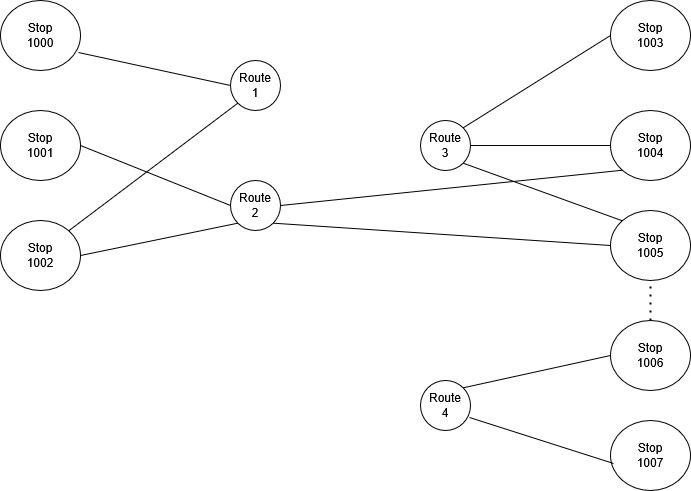

# BusNet - Readme

BusNet is a set of Python routines designed to hold and process public transport information based on GTFS data.  BusNet is not a journey planner as such but is designed for estimating travel times.
BusNet was written by Neil Urquhart of Edinburgh Napier University, any use is entirely at the users' own risk.

# General
BusNet uses the NetworkX graph library to buid a datastructure representing the underlying network.  In this structure each bus stop is a node and each bus route is a node.  Edges are created between stop nodes and route nodes where a route services a particular stop.
Parsing the GTFS files can be slow (especially if you extract from larger data sources such as the UK Bus Open Data  https://www.gov.uk/guidance/find-and-use-bus-open-data ).  To get around this, BusNet once BusNet has parsed the GTFS data and created the graph, it saves the data structure in two pickle files:

 - <name>.graph.pickle
 - <name>.stops.pickle

You may then load the structure quickly from the cache to speed up queries.
 
 # Graph Structure
 Internally BusNet creates a graph structure using NetworkX, to represent bus stops and routes as nodes and edges to associated bus stops with routes and bus stops that are within walking distance.

In the above example, the network comprises 8 bus stops and 4 routes. To get from from stop 1000 to 1001 we follow the path:
	
	Stop1000 -> Route 1 -> Stop 1002 -> Route 2 -> Stop1001

In practice that becomes:
1. Walk to stop 1000
2. Travel by Route 1 to Stop 1002
3. Travel by route 2 to Stop 1001

In the above example, note that stops 1005 and 1007 are linked by an edge, this denotes that the stops are within reasonable walking distance. These walking edges are added between any pair of stops that are less than 20m apart. For example when searching for a route between stops 1004 and 1007, the correct path would be:

	Stop 1004 -> Route 3 -> Stop 1005 -> walk -> Stop 1006 -> Route 4 -< Stop 1007

After using path finding to determine a set of candidate paths between the start and end stops, the travel time of each path is calculated.  Times for running between stops is based on the average running time (as specified in the GTFS feed) for daytime services.  Each route node having a matrix of travel times between stops.

Waiting time at a stop node is specified as half of the average frequency of the bus route.

Walking distances are calculated using the Haversine formula and converted to times based on a walking speed of 1.2 meters/second.

# Usage
The notebook BusNetDemo.ipynb demonstrates the use of the library, new users should start with that. Note that a sample cache for the Scottish city of Dundee is already provided.

##  Initialisation - with an existing cache

Assuming that you have the cache files:

-   dundeeworking.graph.pickle
-   dundeeworking.stops.pickle

you can initialise BusNet directly from the cache as below:

	import BusNet4 as bus
	bus.setup(cache="dundeeworking")

Please see BusNetDemo .ipynb for the list of Python libraries needed 

## Initialisation - creating a new cache

To create a BusNet instance starting without a cache, you will need a set of GTFS files from which to extract your data. BusNet was designed to work with UK Bus Open Data and therefore assumes that you will be extracting a subset of data from a larger GTFS file. 
To create a new cache you wil need :
- a folder containing your GTFS files
- a set of coordinates that bounds the geographical area that you wish to extract
- a list of agencies (i.e bus operators) whose routes will form your network

The names of the agencies should be drawn from the gtfs agency.txt file.

The following example was used to create the Dundee bus network:
	
	j = json.load(open('./dundee_boundaries.geojson'))    
	j = j['features'][0]
	coords = j['geometry']['coordinates'][0]
	dundeeBoundary = []
	for c in coords:
    dundeeBoundary.append(Point(c[1],c[0]))
    
dundeeBoundary now contains a list of points that define Dundee. Only those services within that polygon will be extracted.
  
	bus.setup(cache="dundeeworking",validAgency = ["Ember","Stagecoach East Scotland","Moffat & Williamson","Xplore Dundee"],boundingPoly = dundeeBoundary)

The resulting BusNet object contains a network of all of the bus routes provided by the 4 specified operators within the specified polygon.    If the above command is executed and the cache files exist then the network will be loaded from the cache files.  To regenerate the cache files you must delete or rename the existing files. Note that BusNet does add journeys or routes operated between 00:00 and 06:00 to the network - such overnight routes may have radically different routes, frequencies and running times and as such will skew the average journey times.

Please be aware that extracting from a large example such as the UK Bus Open Data files can take a while, creating the Dundee example as above will take 30-40 minutes. The user may wish to think about extracting a smaller GTFS data source before using BusNet.

## Querying BusNet

### Simple query
The fundimental use of BusNet is to find out the likely journey time between two locations. To achieve this we use the findPath() method, specifying the start and end locations as lattitude/longitude pairs for example:

	start = (56.46356336480093, -3.0368739883858193) 
	dest = (56.47163455953654, -3.0114212570733745)
	r = bus.findPath(start,end=dest,walk=0.5)

As the start and end locations may not correspond directly to a bus stop, it is necessary to find the nearest stops to those locations, the radius to search is specified by the walk parameter. The above example will look for stops within 0.5km of the start and end location. 
The tuple returned by findPath() has 4 elements as follows:

- status, should be 'found' if all has worked, otherwise an eror message
- time of journey in mins (includes walking)
- summary of journey, bus stop codes and services used 
- verbose description of journey - used for debugging

The above example returns the following:

	(
	'found', 
	37.41761186460506, 
	['start', '640011695', '10:Xplore Dundee:Broughty Ferry', '6400PT1174', 'end'], 
	['Journey:', '0 : start', 0, '1 : 640011695', 'James Arnott Drive', 8.692099103675641, '2 : 10:Xplore Dundee:Broughty Ferry', 29.024197869107738, '3 : 6400PT1174', 'Lochee By-Pass', 29.024197869107738, '4 : end', 37.41761186460506]
	)
In summary- a route was found, that will take 37 minutes, based on using service no. 10 operated by Xplore Dundee between stops 640011695 and 6400PT1174 (the UK bus operators database uses NAPTAN codes more about which can be found here https://www.data.gov.uk/dataset/ff93ffc1-6656-47d8-9155-85ea0b8f2251/naptan ).

The last element was intended as a debugging tool, but may be used with care to extract more information about the proposed route.

### City Centre Query

Rather than specifying a specific end point, findRoute can also accept a polygon (as a list of coordinates) and find routes from the start to any point within the polygon, this can be useful while trying to find routes to a city centre district:

	start = (56.46356336480093, -3.0368739883858193)
	city_centre=[]
	city_centre.append(Point(56.45521456343855, -2.975808604)) 
	city_centre.append(Point(56.46084193778188, -2.9768997916807534)) 
	city_centre.append(Point(56.463990223978904, -2.967079106389851)) 
	city_centre.append(Point(56.460239044693814, -2.9604107398342996)) 
	r = bus.findPath(start,walk=0.5,centre=city_centre)

The findPath() method will now find the quickest route from start to any stop within the city_centre polygon.
                                                                             
### getStops()
                                                                             
The getStops() method returns a GeoPandas table containing details of all the bus stops within the network.

